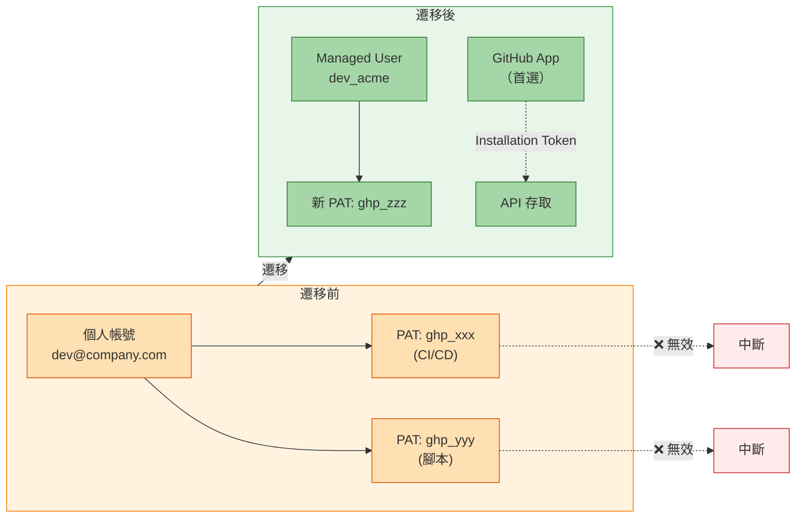

# 遷移至 GitHub Enterprise Managed Users 完整指南 - 第 4 部分：安全性與合規性

> **📚 系列：遷移至 GitHub Enterprise Managed Users 完整指南**
> 這是 EMU 遷移指南系列的**第 4 部分，共 6 部分**。
>
> | 部分 | 主題 |
> |------|------|
> | [第 1 部分：探索與決策](Part1-Discovery&Decision.md) | 定義目標、評估適用性、取得共識 |
> | [第 2 部分：遷移前準備](Part2-Pre-MigrationPreparation.md) | 盤點、清理、IdP 準備、使用者溝通 |
> | [第 3 部分：身分識別與存取設定]Part3-Identity&Access-Setup.md) | 設定 SCIM、佈建使用者、建立團隊 |
> | **[第 4 部分：安全性與合規性](Part4-Security&Compliance.md)**（您在此處） | 稽核記錄、安全強化、整合 |
> | [第 5 部分：遷移執行](Part5-MigrationExecution.md) | 執行 GEI、遷移儲存庫 |
> | [第 6 部分：驗證與採用](Part6-Validation&Adoption.md) | 測試、使用者培訓、OSS 策略、正式上線 |

---

# 第 4 階段：安全性與合規性

在你開始搬移儲存庫和引導使用者上線之前，需先建立安全防護措施，此階段涵蓋稽核記錄、企業政策等整合

## 稽核記錄與合規性 (Audit Logs & Compliance)

EMU 提供詳細的稽核記錄，對合規性和安全監控至關重要

### 合規框架對應

- EMU 的控制措施與常見的合規框架有良好的對應，以下是 EMU 功能如何支援特定要求：

  | 框架 | 相關控制 | EMU 如何提供幫助 |
  |------|----------|-----------------|
  | **SOC 2** | Access Control (CC6.1)、User Authentication (CC6.6) | 集中式 IdP 身分驗證、自動取消佈建、稽核軌跡 |
  | **HIPAA** | Access Controls (164.312(a))、Audit Controls (164.312(b)) | 透過 IdP 群組進行角色型存取、詳細稽核記錄 |
  | **FedRAMP** | IA-2 (Identification)、AC-2 (Account Management) | SSO 強制執行、自動化帳號生命週期、Session 管理 |
  | **PCI-DSS** | Requirement 7 (Restrict Access)、Requirement 8 (Identify Users) | 唯一使用者 ID、透過 IdP 的 MFA、存取記錄 |
  | **GDPR** | Article 32 (Security of Processing) | 資料駐留選項、存取控制、透過 IdP 的刪除權 |
  | **ISO 27001** | A.9 (Access Control) | 身分管理、使用者佈建、存取審查 |

  > 注意：這不代表你自動符合合規要求，這些是 EMU **幫助**你達到合規狀態的領域

- 關鍵合規效益：
  - **單一事實來源**：所有存取決策都 IdP 出發，簡化稽核證據的收集
  - **自動化離職處理**：取消佈建的使用者會立即失去存取權限，無需手動清理
  - **不可竄改的稽核軌跡**：GitHub 的稽核記錄提供所有操作的防竄改記錄
  - **職責分離**：透過 IdP 群組進行角色型存取，確保適當的分離

### 記錄內容

稽核記錄會擷取：
- 使用者身分驗證事件
- 儲存庫存取和修改
- 組織和團隊變更
- SAML SSO 和 SCIM 身分資訊
- 來源 IP 位址（啟用時）
- Token 型存取識別

> 注意：事件保留 180 天，Git 事件保留 7 天，如需長期保留，請設定串流到 SIEM 或雲端儲存

### 串流稽核記錄

- 如需長期保留和 SIEM 整合，請設定稽核記錄串流：

  ```mermaid
  flowchart LR
      GH[GitHub Enterprise] -->|Webhook| STREAM[Audit Log Stream]
      STREAM --> SPLUNK[Splunk]
      STREAM --> DATADOG[Datadog]
      STREAM --> SENTINEL[Azure Sentinel]
      STREAM --> S3[AWS S3]
      STREAM --> GCS[Google Cloud Storage]
      STREAM --> BLOB[Azure Blob Storage]
      style GH fill:#a5d6a7,stroke:#2e7d32,color:#333
      style STREAM fill:#b3e5fc,stroke:#0288d1,color:#333
      style SPLUNK fill:#ffe0b2,stroke:#e65100,color:#333
      style DATADOG fill:#ffe0b2,stroke:#e65100,color:#333
      style SENTINEL fill:#ffe0b2,stroke:#e65100,color:#333
      style S3 fill:#ffe0b2,stroke:#e65100,color:#333
      style GCS fill:#ffe0b2,stroke:#e65100,color:#333
      style BLOB fill:#ffe0b2,stroke:#e65100,color:#333
  ```

- 設定詳情請參閱 [Streaming the audit log for your enterprise](https://docs.github.com/en/enterprise-cloud@latest/admin/monitoring-activity-in-your-enterprise/reviewing-audit-logs-for-your-enterprise/streaming-the-audit-log-for-your-enterprise)。

#### 啟用 API Request Event 串流

預設情況下，稽核記錄串流僅包含 Web（UI）事件。為了完整可見性，可啟用 **API Request Events**。這些記錄了對你企業發出的每個 REST 和 GraphQL API 呼叫，這對於偵測自動化存取模式、識別設定錯誤的整合以及滿足合規要求至關重要。

- 啟用 API Request Event 串流：
  1. 導覽至你的企業設定 → Audit log → Log streaming
  2. 選擇你已設定的串流
  3. 勾選 **Enable API Request Events**

  > **⚠️ 警告：** API Request Events 產生的資料量遠大於 Web 事件——根據你的自動化足跡，通常多出 10-100 倍。確保你的串流目的地可以處理增加的吞吐量，並且你已為額外的儲存和攝取成本做好預算。先在測試時段啟用以評估資料量，然後再正式啟用

- 詳情請參閱 [Streaming the audit log for your enterprise - API request events](https://docs.github.com/en/enterprise-cloud@latest/admin/monitoring-activity-in-your-enterprise/reviewing-audit-logs-for-your-enterprise/streaming-the-audit-log-for-your-enterprise#enabling-audit-log-streaming-of-api-requests)。

#### 啟用來源 IP 揭露

預設情況下，GitHub 稽核記錄事件不包含執行者的來源 IP 位址。為了安全監控、事件回應和合規性，你需要啟用 **IP source disclosure**，使每個稽核事件都包含來源 IP 位址。

- 要啟用來源 IP 揭露：
  1. 導覽至你的企業設定 → Settings → Authentication security
  2. 在 **IP allow list** 下，啟用 **Display IP addresses in audit log**

- 啟用後，你的稽核記錄事件將包含 `actor_ip` 欄位，這對以下用途有價值：
  - **事件回應**：將可疑活動與已知 IP 範圍進行關聯
  - **地理封鎖驗證**：確認存取僅來自預期的地點
  - **Conditional Access Policy 執行**：驗證 Entra ID CAP 是否按預期運作
  - **合規證據**：向稽核人員展示存取控制的執行情況

  > **注意：** Enterprise 擁有者應該將此變更通知使用者，因為 IP 記錄可能根據所在司法管轄區有隱私影響，啟用前請諮詢你的法務和隱私團隊

- 設定步驟請參閱 [Displaying IP addresses in the audit log for your enterprise](https://docs.github.com/en/enterprise-cloud@latest/admin/monitoring-activity-in-your-enterprise/reviewing-audit-logs-for-your-enterprise/displaying-ip-addresses-in-the-audit-log-for-your-enterprise)。

### Audit Log API

- 如需以程式方式存取，請使用 Audit Log API：

  ```bash
  # Get recent audit events
  gh api \
    -H "Accept: application/vnd.github+json" \
    /enterprises/{enterprise}/audit-log
  ```

  > 注意：建議將稽核記錄串流到其他地方進行資料處理，而不是呼叫 API，因為 API 有特定的速率限制，在繁忙的環境中可能無法跟上

- 請參閱 [Using the audit log API for your enterprise](https://docs.github.com/en/enterprise-cloud@latest/admin/monitoring-activity-in-your-enterprise/reviewing-audit-logs-for-your-enterprise/using-the-audit-log-api-for-your-enterprise)。

## 安全強化最佳實務 (Conditional Access & Enterprise Policy)
### Conditional Access Policies (OIDC)

- 若使用 OIDC 搭配 Entra ID，可以強制執行特定的 Conditional Access Policies
- 請參閱 [About support for your IdP's Conditional Access Policy](https://docs.github.com/en/enterprise-cloud@latest/admin/identity-and-access-management/using-enterprise-managed-users-for-iam/about-support-for-your-idps-conditional-access-policy)。


### Enterprise Policy

- 設定企業級政策以強制執行安全標準：
  - **儲存庫可見性**：限制為僅限 Private 和 Internal
  - **儲存庫建立**：控制誰可以建立儲存庫
  - **Forking**：限制 Forking 僅在企業內
  - **Actions 權限**：限制為已驗證或企業核准的 Actions
  - **Code Security**：預設啟用 Secret Scanning 和 Code Scanning

- 請參閱 [Enforcing policies for your enterprise](https://docs.github.com/en/enterprise-cloud@latest/admin/enforcing-policies/enforcing-policies-for-your-enterprise)。

### Secret Scanning 和 Push Protection
- 如果有 GitHub Advanced Security，請在企業層級啟用 Secret Scanning 和 Push Protection：

  ```
  Enterprise Settings → Code security and analysis → Enable for all repositories
  ```

## Token 遷移策略

Personal Access Tokens (PATs) 是 EMU 遷移中最容易被忽略的面向之一，在舊環境中綁定到個人帳號的每個 Token 都會失效

### 了解 Token 問題

在標準 GHEC 中，PATs 綁定到個人帳號，當遷移到 EMU 時：

- **舊 Tokens 停止運作**：它們綁定到不再有存取權限的帳號
- **必須建立新 Tokens**：由 EMU 企業中的 Managed Users 建立
- **自動化中斷**：CI/CD Pipelines、腳本和整合會失敗
- **Service Accounts 需要重新思考**：「共用 Service Account」模式的運作方式不同



### 步驟 1：盤點現有 Tokens

在遷移 Tokens 之前，你需要知道目前有哪些 Tokens。**但現行因安全性考量並無 API 可以列出組織中的所有 PATs**，可利用以下方式：

**1. 稽核記錄分析**

在稽核記錄中搜尋 Token 使用模式：

```bash
# Export audit log entries for token-related events
gh api orgs/YOUR_ORG/audit-log \
  --paginate \
  -X GET \
  -f phrase='action:oauth_access.create OR action:personal_access_token.create' \
  --jq '.[] | {actor: .actor, action: .action, created_at: .created_at}' \
  > token_audit.json

# Look for API authentication patterns
gh api orgs/YOUR_ORG/audit-log \
  --paginate \
  -X GET \
  -f phrase='action:repo.download_zip' \
  --jq '.[] | {actor: .actor, actor_ip: .actor_ip, created_at: .created_at}' \
  > api_usage.json
```

**2. 團隊調查**

建立一個 Token 盤點表單讓團隊回報：

| Token 用途 | 擁有者 | 範圍 | 使用位置 | 到期日 | 遷移計畫 |
|-----------|--------|------|----------|--------|----------|
| Jenkins CI | @devops-team | repo, workflow | Jenkins 伺服器 | 永不 | 轉換為 GitHub App |
| 部署腳本 | @platform | repo, packages | deploy.sh | 2025-06-01 | 新 Managed User PAT |
| Slack 整合 | @integrations | repo:status | Slack App 設定 | 永不 | 使用 GitHub App for Slack |
| 個人自動化 | @jsmith | repo, gist | 本地腳本 | 永不 | 使用者建立新 PAT |

**3. 檢查 CI/CD 設定**

掃描儲存庫中硬編碼或引用的 Tokens：

```bash
# Search for PAT references in workflow files
gh api search/code \
  -X GET \
  -f q='org:YOUR_ORG filename:.yml path:.github/workflows GITHUB_TOKEN OR ghp_ OR github_pat_' \
  --jq '.items[] | {repo: .repository.full_name, path: .path}'

# Check for secrets references
gh api search/code \
  -X GET \
  -f q='org:YOUR_ORG secrets. filename:.yml' \
  --jq '.items[] | {repo: .repository.full_name, path: .path}'
```

### 步驟 2：分類 Tokens

不是所有 Tokens 都要以相同方式遷移，對每個 Token 進行分類：

| 分類 | 描述 | 遷移路徑 |
|------|------|----------|
| **轉換為 GitHub App** | 自動化、CI/CD、整合 | 建立/安裝 GitHub App |
| **Machine User PAT** | Service Accounts、共用自動化 | 佈建專用 Managed User |
| **個人使用者 PAT** | 個人腳本、IDE 身分驗證 | 使用者在遷移後建立新 PAT |
| **淘汰** | 未使用、重複或過時 | 不遷移 |

### 步驟 3：為自動化建立 GitHub Apps

對於多數自動化使用案例，GitHub Apps 是首選解決方案。它們提供：

- **細粒度權限**：只要求你需要的權限
- **短期 Tokens**：Installation Tokens 在 1 小時後過期
- **稽核軌跡**：所有操作都歸屬於該 App
- **不依賴使用者**：無論使用者變更，App 都會持續運作

**1. 建立用於 CI/CD 的 GitHub App**

```bash
# Create a GitHub App via the UI or API
# Navigate to: Enterprise Settings → GitHub Apps → New GitHub App

# Required permissions for typical CI/CD:
# - Contents: Read and write (clone, push)
# - Pull requests: Read and write (create PRs, add comments)
# - Workflows: Read and write (trigger workflows)
# - Checks: Read and write (report status)
# - Metadata: Read (required for all apps)
```

**2. 產生 Installation Tokens**

```bash
#!/bin/bash
# generate-installation-token.sh
# Generates a short-lived installation token for a GitHub App

APP_ID="YOUR_APP_ID"
INSTALLATION_ID="YOUR_INSTALLATION_ID"
PRIVATE_KEY_PATH="path/to/private-key.pem"

# Generate JWT
now=$(date +%s)
iat=$((now - 60))
exp=$((now + 600))

header=$(echo -n '{"alg":"RS256","typ":"JWT"}' | base64 | tr -d '=' | tr '/+' '_-' | tr -d '\n')
payload=$(echo -n "{\"iat\":${iat},\"exp\":${exp},\"iss\":\"${APP_ID}\"}" | base64 | tr -d '=' | tr '/+' '_-' | tr -d '\n')

signature=$(echo -n "${header}.${payload}" | openssl dgst -sha256 -sign "${PRIVATE_KEY_PATH}" | base64 | tr -d '=' | tr '/+' '_-' | tr -d '\n')

jwt="${header}.${payload}.${signature}"

# Get installation token
curl -s -X POST \
  -H "Authorization: Bearer ${jwt}" \
  -H "Accept: application/vnd.github+json" \
  "https://api.github.com/app/installations/${INSTALLATION_ID}/access_tokens" \
  | jq -r '.token'
```

**3. 在 GitHub Actions 中使用 Installation Tokens**

```yaml
# .github/workflows/deploy.yml
name: Deploy with GitHub App

on:
  push:
    branches: [main]

jobs:
  deploy:
    runs-on: ubuntu-latest
    steps:
      - name: Generate GitHub App Token
        id: app-token
        uses: actions/create-github-app-token@v1
        with:
          app-id: ${{ vars.APP_ID }}
          private-key: ${{ secrets.APP_PRIVATE_KEY }}
          owner: ${{ github.repository_owner }}
      
      - name: Checkout with App Token
        uses: actions/checkout@v4
        with:
          token: ${{ steps.app-token.outputs.token }}
      
      - name: Push changes
        run: |
          git config user.name "my-automation-app[bot]"
          git config user.email "123456+my-automation-app[bot]@users.noreply.github.com"
          # ... make changes ...
          git push
        env:
          GITHUB_TOKEN: ${{ steps.app-token.outputs.token }}
```

### 步驟 4：設定 Machine Users

有些整合無法使用 GitHub Apps，它們需要 PAT，對於這些情況，建立專用的 Machine Users（專門用於自動化的 Managed User 帳號）：

**1. 佈建 Machine User**

- **在 IdP 中建立專用身分**
   - 使用描述性名稱：`svc-github-jenkins`、`bot-deploy-automation`
   - 使用群組信箱或通訊群組清單作為電子郵件
   - 在 IdP 中指派至 GitHub EMU 應用程式

- **SCIM 在 GitHub 上佈建帳號**
   - 使用者名稱將類似 `svc-github-jenkins_acme`
   - 帳號像其他使用者一樣被管理

- **為 Machine User 建立 PAT**
   - 以 Machine User 身分登入（你需要 IdP 憑證）
   - 產生具有最小必要權限的 Fine-Grained PAT
   - 設定適當的到期日（並在日曆上設定輪換提醒！）

- **安全地儲存 Token**
   - 使用密鑰管理工具（Vault、Azure Key Vault、AWS Secrets Manager）
   - 永遠不要將 Tokens 提交到儲存庫
   - 實施 Token 輪換程序

**2. Machine User 最佳實務**

| 實務 | 原因 |
|------|------|
| 每個整合使用一個 Machine User | 隔離、更容易稽核、更簡單的撤銷 |
| 最小權限 | 最小權限原則 |
| 描述性命名 | 使用 `svc-*` 或 `bot-*` 前綴以便識別 |
| Token 到期 | 最長 90 天，搭配輪換流程 |
| 記錄擁有權 | 必須有人對每個 Machine User 負責 |
| 定期存取審查 | 納入季度存取認證 |

### 步驟 5：Fine-Grained PATs 與 Classic PATs

EMU 支援兩種 Token 類型，建議使用 Fine-Grained PATs 為主：

| 功能 | Classic PAT | Fine-Grained PAT |
|------|-------------|------------------|
| 權限細粒度 | 廣泛範圍 | 每個儲存庫、特定權限 |
| 到期日 | 選用 | 必須（最長 1 年） |
| 核准流程 | 無 | 選用（組織可要求） |
| 資源存取 | 所有可存取的儲存庫 | 明確選擇的儲存庫 |
| 稽核可見性 | 有限 | 詳細 |

**1. 啟用 Fine-Grained PAT 控制**

```bash
# Require approval for fine-grained PATs (recommended)
gh api orgs/YOUR_ORG \
  -X PATCH \
  -f personal_access_token_requests_enabled=true

# Restrict classic PAT access (optional but recommended)
# This can be done via Enterprise Settings → Policies → Personal access tokens
```

**2. 建立 Fine-Grained PAT**

```bash
# Via UI: Settings → Developer settings → Personal access tokens → Fine-grained tokens

# Recommended settings:
# - Expiration: 90 days or less
# - Repository access: Only select repositories
# - Permissions: Minimum required for the use case
```

### 步驟 6：更新使用者

建立新 Tokens 後，更新所有使用者：

**1. CI/CD Pipelines 改為採用 GitHub Apps**

```yaml
# Before: Using personal PAT stored in org secrets
env:
  GITHUB_TOKEN: ${{ secrets.DEPLOY_PAT }}

# After: Using GitHub App installation token
- uses: actions/create-github-app-token@v1
  id: app-token
  with:
    app-id: ${{ vars.DEPLOY_APP_ID }}
    private-key: ${{ secrets.DEPLOY_APP_KEY }}
```

**2. 外部系統**

| 系統 | 更新位置 | 備註 |
|------|----------|------|
| Jenkins | Credentials Store | 更新 GitHub 伺服器設定 |
| ArgoCD | Repository Secrets | 更新所有儲存庫憑證 |
| Terraform | Provider Config 或環境變數 | 可能需要 State 遷移 |
| 腳本 | 環境變數 | 更新部署文件 |

**3. 本地開發**

與開發者溝通：
1. 舊 PATs 將在遷移日停止運作
2. 從他們的 Managed User 帳號建立新 PATs
3. 更新 Git Credential Helpers：`git credential reject`
4. 重新驗證 IDE 外掛

### 步驟 7：驗證並撤銷

遷移後，驗證新 Tokens 運作且舊 Tokens 已被撤銷：

```bash
# Test new token
curl -H "Authorization: token NEW_TOKEN" \
  https://api.github.com/user

# Verify access to expected resources
curl -H "Authorization: token NEW_TOKEN" \
  https://api.github.com/repos/YOUR_ORG/test-repo

# Old tokens should fail with 401
curl -H "Authorization: token OLD_TOKEN" \
  https://api.github.com/user
# Expected: {"message":"Bad credentials"...}
```

### Token 遷移檢查清單

| 任務 | 負責人 | 狀態 |
|------|--------|------|
| 完成 Token 盤點 | | ☐ |
| 依遷移路徑分類所有 Tokens | | ☐ |
| 為自動化建立 GitHub Apps | | ☐ |
| 在 EMU 企業中安裝 GitHub Apps | | ☐ |
| 在 IdP 中佈建 Machine Users | | ☐ |
| 為 Machine Users 建立 PATs | | ☐ |
| 將新 Tokens 儲存在密鑰管理工具中 | | ☐ |
| 更新 CI/CD Pipelines | | ☐ |
| 更新外部系統設定 | | ☐ |
| 通知開發者重新建立 PATs | | ☐ |
| 使用新 Tokens 測試所有整合 | | ☐ |
| 記錄 Token 輪換程序 | | ☐ |
| 排程 Token 到期提醒 | | ☐ |
| 驗證舊 Tokens 不再運作 | | ☐ |

## GitHub App 遷移

安裝在舊環境中的 GitHub Apps 不會自動轉移到 EMU，需要在新企業中重新安裝

### GitHub Apps 的類型

了解不同類型有助於規劃遷移：

| 類型 | 描述 | 遷移方式 |
|------|------|----------|
| **Marketplace Apps** | 來自 GitHub Marketplace 的第三方 Apps | 從 Marketplace 重新安裝 |
| **Organization Apps** | 由你的組織建立的 Apps | 重新建立或轉移擁有權 |
| **Private Apps** | 未發布的內部 Apps | 在新企業中重新建立 |

### 步驟 1：盤點已安裝的 Apps

列出所有組織中的 GitHub Apps：

```bash
# List installed apps for an organization
gh api orgs/YOUR_ORG/installations \
  --jq '.installations[] | {
    app_slug: .app_slug,
    app_id: .app_id,
    id: .id,
    repository_selection: .repository_selection,
    permissions: .permissions
  }' > installed_apps.json

# For each app, document:
# - App name and purpose
# - Current permissions
# - Repository access (all or selected)
# - Who owns/manages the app
# - EMU compatibility status
```

**建立 App 盤點清單**

| App 名稱 | 類型 | 用途 | 權限 | 儲存庫存取 | 擁有者 | EMU 相容 | 遷移狀態 |
|----------|------|------|------|-----------|--------|----------|----------|
| Jira | Marketplace | Issue 追蹤 | issues:write, pull_requests:read | 全部 | @devops | ✅ 是 | ☐ 待處理 |
| Dependabot | GitHub | 安全更新 | contents:write, pull_requests:write | 全部 | GitHub | ✅ 是 | ☐ 待處理 |
| Custom Deploy Bot | 內部 | 部署自動化 | contents:write, deployments:write | 選定 | @platform | 需測試 | ☐ 待處理 |
| Legacy Webhook App | 內部 | 通知 | metadata:read | 全部 | 未知 | ❓ 未知 | ☐ 調查中 |

### 步驟 2：檢查 EMU 相容性

並非所有 Apps 都能與 EMU 搭配使用，與供應商確認或在沙箱中測試：

**常見相容性問題**

- **使用者層級 OAuth**：以使用者身分進行驗證的 Apps 可能功能有限
- **公開儲存庫功能**：與公開儲存庫互動的 Apps 不會運作
- **跨企業存取**：Apps 無法存取企業外的資源
- **使用者個人資料存取**：對 Managed User 個人資料資訊的存取有限

**供應商相容性確認範本**

聯繫供應商時，請詢問：

1. App 是否支援使用 EMU 的 GitHub Enterprise Cloud？
2. 使用 Managed Users 是否有功能限制？
3. EMU 是否需要不同的安裝流程？
4. 是否需要設定變更？
5. 需要哪些權限，它們是否與 EMU 相容？

### 步驟 3：遷移 Marketplace Apps

對於來自 GitHub Marketplace 的 Apps：

1. 在 Marketplace 列表或供應商文件中**驗證 EMU 支援**
2. **在新企業中安裝**：Enterprise Settings → GitHub Apps → Install from Marketplace
3. **設定 App 設定**：套用與原始安裝相同的設定
4. **授予儲存庫存取**：選擇儲存庫或授予組織級存取
5. **測試功能**：驗證 App 是否按預期運作

```bash
# After installation, verify the app is installed
gh api orgs/YOUR_ORG/installations \
  --jq '.installations[] | select(.app_slug == "APP_NAME")'
```

### 步驟 4：重新建立內部/私有 Apps

對於你組織建立的 Apps：

**選項 A：在 EMU 企業中建立新 App**

如果你有原始碼且可以重新建立 App：

1. **匯出目前 App 設定**
   ```bash
   # Document current app settings
   gh api apps/YOUR_APP_SLUG \
     --jq '{
       name: .name,
       description: .description,
       permissions: .permissions,
       events: .events
     }' > app_config.json
   ```

2. **在 EMU 企業中建立新 App**
   - 導覽至 Enterprise Settings → GitHub Apps → New GitHub App
   - 套用已儲存的設定
   - 產生新的 Private Key
   - 記下新的 App ID 和 Installation ID

3. **使用新憑證更新 App 程式碼**
   ```bash
   # Update environment variables or config
   export GITHUB_APP_ID="new_app_id"
   export GITHUB_APP_INSTALLATION_ID="new_installation_id"
   # Replace private key file
   ```

4. **在組織中安裝**
   ```bash
   # Install app in your EMU organizations
   # Via UI: Organization Settings → GitHub Apps → Install
   ```

5. **徹底測試**
   - 驗證 Webhook 傳遞
   - 測試所有 API 操作
   - 確認權限是否足夠

**選項 B：轉移 App 擁有權（如果支援）**

在某些情況下，你可以轉移 App 擁有權：

1. 目前擁有者必須發起轉移
2. 新擁有者（EMU 企業管理員）接受
3. 轉移後更新安裝設定
4. 為安全性重新產生 Private Keys

> **注意：** App 轉移很複雜，可能不會保留所有設定。重新建立通常更乾淨。

### 步驟 5：處理 Webhooks

Apps 常依賴 Webhooks，這些需要重新設定：

```bash
# List current webhooks
gh api orgs/YOUR_ORG/hooks \
  --jq '.[] | {
    id: .id,
    name: .name,
    active: .active,
    url: .config.url,
    events: .events
  }'

# After migration, recreate webhooks with new secrets
gh api orgs/NEW_ORG/hooks \
  -X POST \
  -f name='web' \
  -f active=true \
  -f events[]='push' \
  -f events[]='pull_request' \
  -f config[url]='https://your-webhook-endpoint.com/github' \
  -f config[content_type]='json' \
  -f config[secret]='NEW_WEBHOOK_SECRET'
```

**Webhook 遷移檢查清單**

| Webhook URL | 事件 | 目前 Secret 位置 | 新 Secret 已建立 | 已測試 |
|-------------|------|-----------------|-----------------|--------|
| https://jenkins.internal/github | push, pr | Jenkins Credentials | ☐ | ☐ |
| https://slack.com/webhook/xxx | push, issues | Slack App Config | ☐ | ☐ |

### 步驟 6：更新 App 身分驗證

重新建立 Apps 後，更新所有進行驗證的地方：

**GitHub Actions Workflows**

```yaml
# Update App ID and private key references
- uses: actions/create-github-app-token@v1
  with:
    app-id: ${{ vars.NEW_APP_ID }}  # Updated
    private-key: ${{ secrets.NEW_APP_PRIVATE_KEY }}  # New key
```

**外部服務**

| 服務 | 設定位置 | 需更新的值 |
|------|----------|-----------|
| Jenkins | Manage Jenkins → Credentials | App ID、Private Key、Installation ID |
| ArgoCD | argocd-cm ConfigMap | GitHub App 憑證 |
| Backstage | app-config.yaml | integrations.github 區段 |
| 自訂服務 | 環境變數 | 所有 GitHub App 憑證 |

### 步驟 7：驗證 App 功能

為每個遷移的 App 建立測試計畫：

```markdown
## App 遷移測試計畫：[App 名稱]

### 遷移前基準
- [ ] 記錄目前 App 行為
- [ ] 擷取範例 Webhook Payloads
- [ ] 記下 API 回應格式

### 遷移後測試
- [ ] App 安裝在組織設定中可見
- [ ] Webhook 傳遞成功（檢查 App Settings → Advanced）
- [ ] API 身分驗證運作
- [ ] 所有預期權限已授予
- [ ] 儲存庫存取正確（全部 vs. 選定）
- [ ] 事件訂閱正確觸發

### 功能測試
- [ ] [測試特定功能 1]
- [ ] [測試特定功能 2]
- [ ] [測試錯誤處理]

### 回退計畫
- [ ] 記錄如發現問題如何還原
- [ ] 識別關鍵路徑依賴
```

### GitHub App 遷移檢查清單

| 任務 | 負責人 | 狀態 |
|------|--------|------|
| 盤點所有已安裝的 GitHub Apps | | ☐ |
| 記錄 App 用途和擁有者 | | ☐ |
| 驗證每個 App 的 EMU 相容性 | | ☐ |
| 聯繫不相容 Apps 的供應商 | | ☐ |
| 重新安裝 Marketplace Apps | | ☐ |
| 重新建立內部 Apps | | ☐ |
| 產生新的 Private Keys | | ☐ |
| 更新 Webhook 設定 | | ☐ |
| 輪換 Webhook Secrets | | ☐ |
| 使用新 App 憑證更新 CI/CD | | ☐ |
| 更新外部服務 | | ☐ |
| 測試所有 App 功能 | | ☐ |
| 停用舊的 App 安裝 | | ☐ |
| 記錄新的 App IDs 和 Installation IDs | | ☐ |

---

> **📚 EMU 遷移指南系列導覽**
>
> ⬅️ **上一篇：[第 3 部分 - 身分識別與存取設定](Part3-Identity&Access%20Setup.md)**
>
> ➡️ **下一篇：[第 5 部分 - 遷移執行](Part5-MigrationExecution.md)**
>
> ---